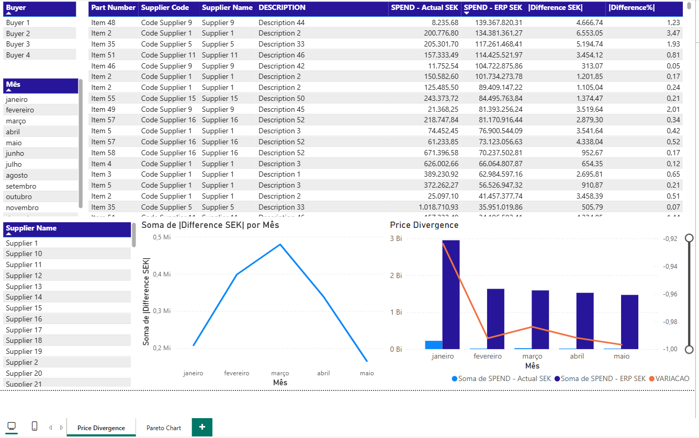

# Automated ERP Price Validation

An end-to-end automation pipeline designed to eliminate manual price validation processes and improve financial accuracy in supplier invoice analysis.


## Overview


This project automates the monthly validation of supplier invoice prices against ERP reference prices using Microsoft Power Automate, Office Scripts, Excel Online and Power BI.


The solution automatically receives a monthly report, extracts transaction records, updates a centralized validation model, compares invoice values against ERP reference prices, calculates deviations and generates analytical dashboards and KPIs.


---
## Key Technical Highlights

- Built a complete automation pipeline using Power Automate, Office Scripts and Power BI.
- Automated supplier invoice validation against ERP reference prices.
- Implemented batch-processing techniques to improve Excel Online performance.
- Developed business-rule driven matching and variance analysis logic.
- Automated currency conversion, spend calculations and KPI generation.
- Delivered interactive reporting through Power BI dashboards.

## Impact

### Business Impact

- Reduced processing time from 20 minutes → **~2 minutes**
- Automated validation of **~2000 records per month**
- Eliminated **90%** of manual work
- Enabled monthly KPI tracking


## Business Problem


Monthly price validation originally required:


- Manual extraction of supplier records

- Manual ERP price comparison

- Manual spend calculations

- Manual KPI generation

- Manual report distribution


The objective of this project was to create a fully automated process capable of validating thousands of records while reducing processing time and minimizing human errors.


---


## Solution Architecture


```text

Monthly Report

     │

     ▼

Outlook Email

     │

     ▼

Power Automate

     │

     ▼

Office Scripts

     │

     ▼

Excel Validation Model

     │

     ▼

ERP Price Matching

     │

     ▼

KPI Generation

     │

     ▼

Power BI Dashboard

     │

     ▼

Automated Reporting

```


---


## Workflow


### 1. Email Processing


Power Automate monitors a mailbox and detects the arrival of the monthly supplier report.


### 2. Attachment Validation


The workflow validates the attachment and creates a cloud copy for processing.


### 3. Data Extraction


Office Scripts extract the required fields from the source workbook:


- Part Number

- Supplier ID

- Supplier Name

- Description

- Currency

- Price

- Volume

- Category


### 4. Data Import


The extracted records are inserted into the validation model using batch processing.


### 5. ERP Comparison


Imported records are matched against ERP reference data.


### 6. Calculations


The process calculates:


- Actual Spend

- ERP Spend

- Price Difference

- Percentage Difference

- Accuracy Metrics


### 7. Reporting


The workflow generates KPIs and distributes results automatically.


---


# Office Scripts


## findEmptyCell.ts


Finds the next available row in the source worksheet.


### Purpose


- Detect insertion boundaries

- Identify populated rows

- Support dynamic data extraction


---


## copyActual.ts


Extracts worksheet data into arrays.


### Purpose


- Read source columns

- Convert Excel values to arrays

- Pass data to Power Automate


### Typical Fields


- Part Number

- Supplier ID

- Supplier Name

- Currency

- Price

- Volume


---


## .ts


Performs batched insertion into the validation table.


### Features


- Array validation

- Data type conversion

- Excel date conversion

- Batch processing

- Error handling


### Benefits


- Faster imports

- Reduced timeout risk

- Improved scalability


---


## updatePriceDivergence.ts


Main business logic script.


### Responsibilities


- ERP matching

- Currency handling

- Spend calculation

- Variance analysis

- KPI generation


### Generated Metrics


- Actual Spend

- ERP Spend

- Difference Amount

- Difference Percentage

- Monthly Accuracy


---


# Power BI Dashboard


The project also includes a Power BI dashboard for monitoring pricing performance and supplier deviations.



## Dashboard Features


### Spend Analysis


Comparison between:


- Actual Spend

- ERP Spend


### Variance Analysis


Visualization of:


- Absolute Difference

- Percentage Difference


### Supplier Analysis


Filtering and investigation by:


- Supplier

- Buyer

- Category


### Trend Analysis


Monthly tracking of:


- Spend Evolution

- Variance Evolution

- Accuracy Evolution


---


## Dashboard Preview


images/dashboard-overview.png


# Technologies


- Microsoft Power Automate

- Microsoft Office Scripts

- TypeScript

- Excel Online

- Microsoft Outlook

- OneDrive for Business

- Power BI


---


# Sample Data


A sample workbook is included in the repository.


All records were generated exclusively for demonstration purposes.


The sample does not contain:


- Real suppliers

- Real prices

- Real buyers

- Real ERP information

- Real business transactions


---


# Repository Structure


```text

price-validation-automation/

│

├── README.md

│

├── scripts/

│   ├── findEmptyCell.ts

│   ├── copyActual.ts

│   ├── pastePDbatch.ts

│   └── updatePriceDivergence.ts

│

├── samples/

│   └── ERP-Price-Validation-Sample.xlsx

│

├── powerbi/

│   └── ERP-Price-Validation-Dashboard.pbix

│

└── images/

         ├── dashboard-overview.png

         └── workflow.png

```


---

## Technical Challenges & Solutions

### 1. Power Automate Timeout Limits

**Problem**
Power Automate flows have execution time limits, causing failures when processing large datasets.

**Solution**
- Implemented **batch processing**
- Split data into chunks of **400 rows**
- Reduced execution time per run

---

### 2. Excel Online Performance Constraints

**Problem**
Excel Online becomes slow when inserting large volumes row-by-row.

**Solution**
- Used **array-based operations (Office Scripts)**
- Implemented **bulk insertion**
- Reduced API calls significantly

---

### 3. Scalability

**Problem**
Process needed to scale from hundreds → thousands of records.

**Solution**
- Designed architecture using:
  - Stateless scripts
  - Batch processing
  - Modular workflow

# Results


### Operational Improvements


- Automated monthly data processing


- Reduced manual effort


- Standardized validation workflow


- Reduced human error risk


- Automated KPI generation


- Centralized reporting


---
